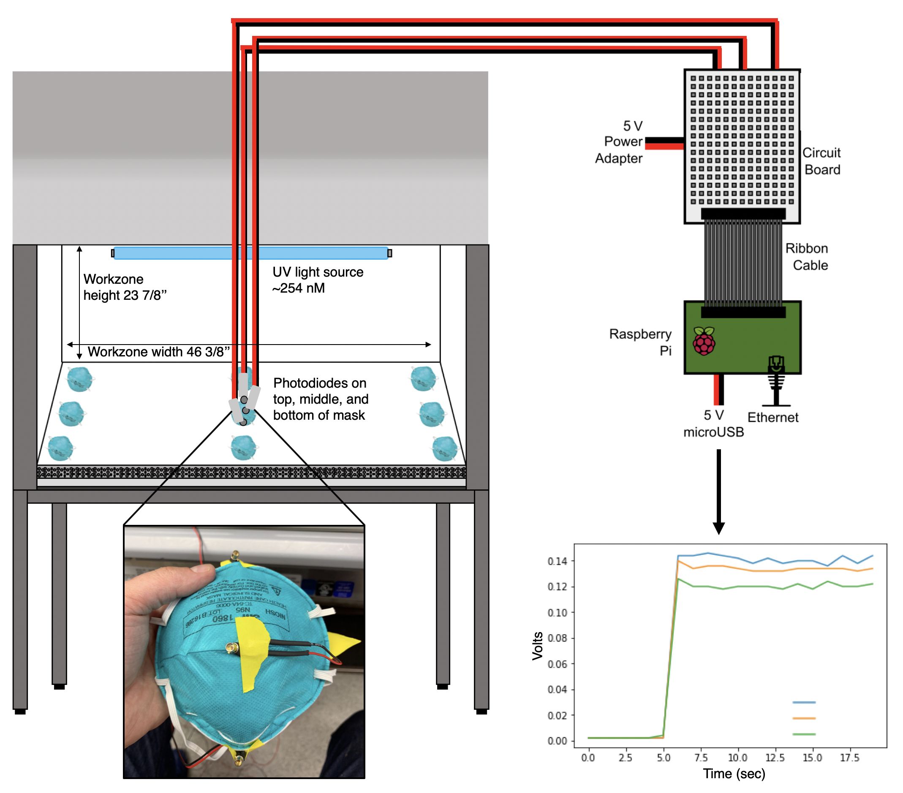

# Sterilizing personal protective equipment using UV-C radiation in idle biosafety cabinets: A potential method to ease the burden during times of exceptional stress on the healthcare system

By the [Theory Division](https://www.lerner.ccf.org/thor/scott/lab/). 

  

This project started out as an effort to provide guidelines on how to use biosafety cabinets (BSCs) (a common piece of laboratory equipment) to achieve the same UV-C radiation dose [currently being used by University of Nebraska Medical Center](https://www.nebraskamed.com/sites/default/files/documents/covid-19/n-95-decon-process.pdf) to decontaminate their masks. Since then it has expanded, and we are currently working with collaborators to validate the safety and efficacy of our proposed protocol. 

An important remaining open question is how much variation exists in UV fluence across the set of BSCs currently available. Ideally, all BSCs would individually have their UV fluence levels measured before use for decontamination procedures, or, at a minimum have had their UV bulb replaced recently (within the past year). However, we are operating under non-ideal circumstances; ideally, single-use PPE would not be reused at all! UV meters are relatively uncommon and UV lamps are in short supply. To assess the risks imposed by these suboptimal conditions, we are hoping to crowdsource a measurement of the UV radiation output achieved by BSCs in use today. If you have access to a biosafety cabinet and a UV measurement device, **you can help by measuring UV fluence in your BSC** following the same protocol outlined here. Submit data either via a pull request on this repository or via this google form: https://forms.gle/XZFRmqmUzFeew2DX8. Thank you!

## Contents of this repository

- **data**: directory containing data on UV radiation at 9 different spatial positions in two different hoods. Data are organized as described in bsc_spatial.Rmd
- **bsc_spatial.Rmd**: An Rmarkdown file containing all of the code to produce the heat maps and summary statistic calculations.
- **bsc_spatial.html**: An html-rendered version of the corresponding Rmarkdown file
- **bsc_data.ipynb**: Some preliminary python analysis code
- **fig3.ipynb**: Calculations on survival of different pathogens over varying UV intensity and temporal analysis of our data
- **uv_record.py**: Code used to record the data.
- **n_95_variance.py**: Code that calculates variance of diode voltage over time.
- **PPE_UV_Manuscript.pdf**: Preliminary manuscript on this work
